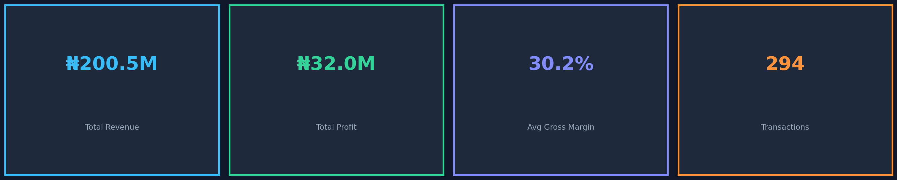
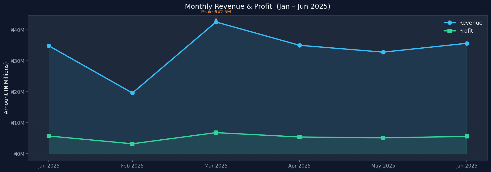
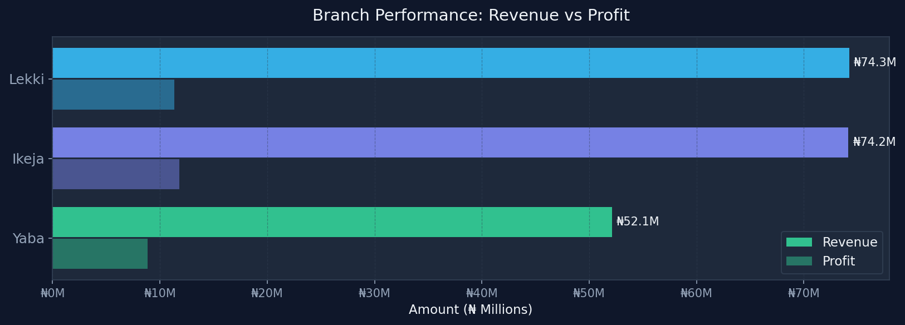
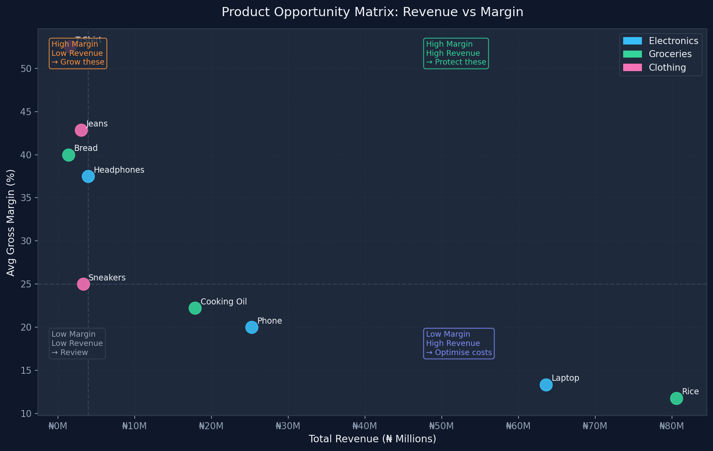

# Nigerian Retail Sales Analysis — Jan to Jun 2025


End-to-end retail sales analysis across three Lagos branches, covering six months of transaction data. The same business questions are answered in **three tools** — SQL for querying, Python for visualization, and Power BI for the interactive dashboard — demonstrating that the analysis logic is tool-agnostic.

---

## Dashboard Preview

| KPI Summary | Monthly Trend |
|---|---|
|  |  |

| Branch Performance | Opportunity Matrix |
|---|---|
|  |  |

---

## The Business Questions This Analysis Answers

1. How much revenue and profit did the business generate across Jan–Jun 2025?
2. Which branch is underperforming — and is it a volume or product mix problem?
3. Which products deserve more investment based on margin, not just revenue?
4. What caused the February dip and March surge?
5. Where is the biggest untapped margin opportunity in the portfolio?

---

## Project Structure

```
retail-sales-analysis/
│
├── data/
│   └── retail_sales_cleaned.xlsx      # Source: 294 transactions, 11 columns
│
├── sql/
│   └── retail_sales_analysis.sql      # 8 sections: QC → KPIs → trends →
│                                      # branches → categories → products →
│                                      # advanced (CTEs, window functions, ABC)
│
├── python/
│   └── visualizations.py              # 8 charts — run once to regenerate all visuals
│
├── powerbi/
│   ├── dashboard_setup_guide.md       # Step-by-step: load data, DAX measures, layout
│   └── retail_sales_dashboard.pbix    # Power BI file (open in Power BI Desktop)
│
├── visuals/                           # All chart outputs (PNG, 150 DPI)
│   ├── 01_kpi_cards.png
│   ├── 02_monthly_trend.png
│   ├── 03_branch_performance.png
│   ├── 04_category_donut.png
│   ├── 05_product_revenue.png
│   ├── 06_margin_by_product.png
│   ├── 07_stacked_branch_monthly.png
│   └── 08_opportunity_matrix.png
│
├── docs/
│   └── analysis_summary.md            # Written narrative: findings + recommendations
│
├── requirements.txt
├── .gitignore
└── README.md
```

---

## Dataset

| Field | Type | Description |
|---|---|---|
| transaction_id | int | Unique identifier |
| date | date | Transaction date |
| branch | text | Lekki · Ikeja · Yaba |
| product_name | text | One of 9 products |
| category | text | Electronics · Groceries · Clothing |
| quantity | int | Units sold |
| unit_price | int | Selling price per unit (₦) |
| unit_cost | int | Cost price per unit (₦) |
| revenue | int | Total revenue (₦) |
| profit | int | Gross profit (₦) |
| margin_% | float | Gross margin ratio |

**No missing values. No duplicates. Date range: 2025-01-01 to 2025-06-30.**

---

## Key Findings

**1. Top-line performance**
₦200.5M revenue · ₦32.0M profit · 30.2% average gross margin · 294 transactions

**2. Yaba is underperforming — but it's a product mix problem, not footfall**
Yaba has 79 transactions vs Ikeja's 129, but its average order value is also lower.
The SQL branch deep-dive (Section 4c) shows Yaba is over-indexed in Groceries
and has almost no Electronics presence — exactly where the revenue is concentrated.

**3. Clothing has a 43% average margin but only 3.9% revenue share**
T-Shirt sits at 52.5% margin. Jeans at 42.9%. Both are in the "High Margin, Low Revenue"
quadrant of the opportunity matrix — prime candidates for promotional push.

**4. Rice and Laptop together = 72% of revenue at under 14% margin**
The business is heavily dependent on two thin-margin products. This is a concentration risk.

**5. March revenue was ₦42.5M — 117% higher than February's ₦19.6M**
The steepest MoM swing in the dataset. The SQL MoM query (Section 3b) surfaces this.
Understanding what drove it is the single highest-value question for the business.

---

## Business Recommendations

| Priority | Recommendation | Rationale |
|---|---|---|
| 🔴 HIGH | Expand Electronics range in Yaba | Yaba's category mix is the root cause of its revenue gap |
| 🔴 HIGH | Investigate the March spike and replicate it | ₦22.9M revenue difference in a single month |
| 🟠 MEDIUM | Run a dedicated Clothing promotion across all branches | 43–53% margins, severely underweighted |
| 🟡 MEDIUM | Reduce dependency on Rice + Laptop | Two products = 72% revenue at <14% margin is concentration risk |
| 🟢 LOW | Renegotiate Laptop supplier cost | Every 1% cost reduction = ~₦636K additional annual profit |

---

## How to Run This Project

### SQL
Load `data/retail_sales_cleaned.xlsx` into any SQL client (DB Browser for SQLite,
DBeaver, pgAdmin, etc.) then run `sql/retail_sales_analysis.sql` section by section.

### Python
```bash
# Clone
git clone https://github.com/YOUR_USERNAME/retail-sales-analysis.git
cd retail-sales-analysis

# Install dependencies
pip install -r requirements.txt

# Generate all charts
python python/visualizations.py
```

### Power BI
Open `powerbi/retail_sales_dashboard.pbix` in Power BI Desktop.
If starting fresh, follow `powerbi/dashboard_setup_guide.md` — it includes
every DAX measure and the full layout spec.

---

## Tech Stack

| Tool | What I used it for |
|---|---|
| **SQL** | Data quality checks, aggregations, window functions (LAG, RANK, running totals), ABC analysis |
| **Python — Pandas** | Data loading, groupby aggregations, pivot tables |
| **Python — Matplotlib & Seaborn** | All 8 production charts |
| **Power BI** | Interactive dashboard with DAX measures, slicers, and drill-through |

These are the four tools I use day-to-day. Every aggregation in Python has a SQL
equivalent in the `.sql` file, and every chart has a Power BI counterpart in the
dashboard — intentionally, to show the analysis logic is consistent across environments.

---

## About

Data analyst with hands-on experience in SQL, Python, and Power BI — looking for
a role where I can turn raw data into decisions that get acted on.

Open to data analyst, BI analyst, and junior analytics engineer roles.

- 📧 kayodeosuya@gmail.com
- 🐙 [GitHub](https://github.com/OCyode)

---

*⭐ If this project was useful, a star helps other analysts find it.*
